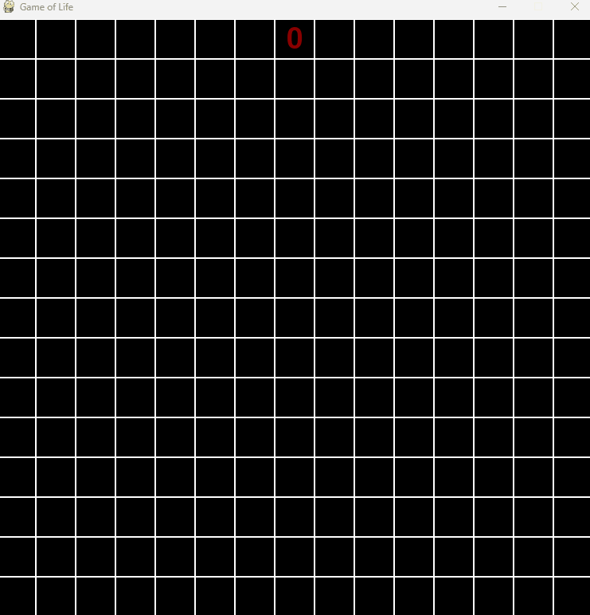

# 🧬 Conway's Game of Life – Pygame Edition

This is a visual and interactive implementation of **Conway's Game of Life**, built using `Pygame` and `NumPy`.

<p align="center">
  
</p>

## 🎮 Features

- Intuitive drawing: click and drag with left mouse to toggle cells.
- Real-time simulation: hold right mouse button to evolve generations.
- Visual generation counter.
- 15x15 pixel grid with smooth cell updates.

## 🧠 How It Works

This project follows the rules of Conway's Game of Life:
- **Underpopulation**: Any live cell with fewer than two live neighbors dies.
- **Overpopulation**: Any live cell with more than three live neighbors dies.
- **Survival**: Any live cell with two or three neighbors lives on.
- **Reproduction**: Any dead cell with exactly three live neighbors becomes a live cell.

## 🖱 Controls

| Action                      | Mouse Button | Effect                         |
|----------------------------|--------------|--------------------------------|
| Toggle cell state          | Left Click   | Activate or deactivate a cell |
| Evolve simulation          | Right Click  | Start slow generation update  |
| Reset generation counter   | Left Drag    | Resets generation number      |

## ⚙ Requirements

- Python 3.x
- [Pygame](https://www.pygame.org/)
- NumPy

Install dependencies with:

```bash
pip install pygame numpy